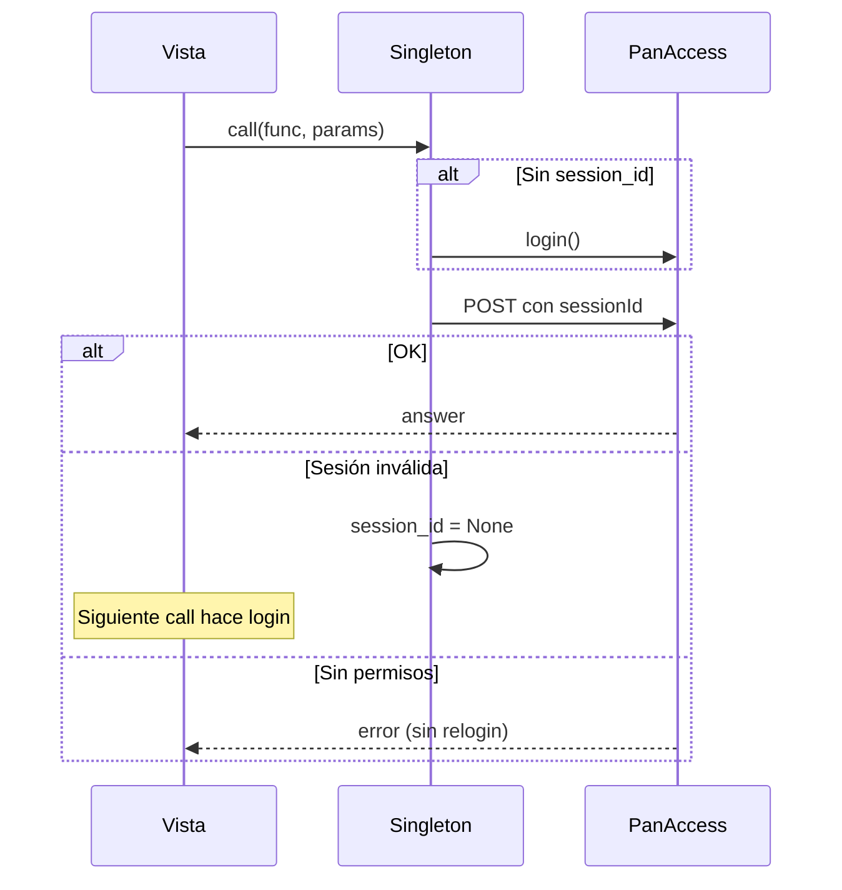

# Análisis de escalabilidad — serverpanaccess

**Fecha:** Mayo 2026  
**Última actualización:** Mayo 2026 (contexto de equipo + singleton PanAccess)  
**Alcance:** Revisión del código, configuración e infraestructura del proyecto Django `serverpanaccess` (app `wind`).  
**Objetivo:** Identificar puntos débiles y definir qué hace falta para soportar **más de 5.000 usuarios concurrentes** realizando solicitudes HTTP.

---

## 0. Contexto y decisiones del equipo

Estas decisiones **no son errores de diseño**, pero condicionan el análisis y el roadmap:

| Tema | Decisión actual | Implicación para escalabilidad |
|------|-----------------|--------------------------------|
| **SQLite en dev** | Activo a propósito: mejor visualización de datos con extensión de Cursor. PostgreSQL preparado en `.env` pero comentado en `settings.py`. | Válido en desarrollo. En **producción con usuarios reales** sigue siendo obligatorio PostgreSQL. |
| **`full-sync`** | Función **correctiva/batch**, pensada para ejecutarse en **horario de bajo tráfico** (ej. medianoche), no como API de uso diario. | El riesgo no es el concepto, sino que hoy sigue siendo **HTTP síncrono** y **no está en Celery Beat**. |
| **Perfil de usuario** | Visión: login con usuario/contraseña o social; módulos de contraseña, productos, compras (futuro), etc. | Parte del camino ya existe (JWT, allauth, `SubscriberEmailRegistry`); falta API de perfil unificada y endurecer seguridad. |
| **Singleton PanAccess** | Sesión del **sistema** (cuenta de servicio `nbr_sw4`), no del usuario final. | Funciona con matices según servidor (runserver vs Daphne) y con límites en recuperación de errores (ver §3.4). |

---

## 1. Resumen ejecutivo

`serverpanaccess` es un **backend Django + DRF** que actúa como puente entre clientes (web/móvil) y la **API externa PanAccess**, con sincronización masiva de suscriptores, productos, smartcards y credenciales. Usa **JWT**, login social (Google/Facebook/Apple) y **Celery + Redis** para tareas programadas.

### Veredicto honesto

| Pregunta | Respuesta |
|----------|-----------|
| ¿Puede hoy soportar 5.000 usuarios concurrentes en producción? | **No**, con SQLite activo y sync pesado aún accesible por HTTP sin throttling. |
| ¿Está mal planteado el dominio? | **No**; combina integración PanAccess (batch) con camino hacia API de perfil de usuario. |
| ¿Es recuperable para escalar? | **Sí**, con PostgreSQL en prod, sync nocturno en Celery, módulo perfil y endurecimiento de seguridad. |

Cuellos de botella principales para **tráfico de usuarios** (no para sync nocturno):

1. **SQLite en producción** (en dev es aceptable).  
2. **Sync pesado aún invocable por HTTP** sin restricción horaria ni solo-worker.  
3. **Llamadas síncronas en cadena a PanAccess** (N+1 externo en login info).  
4. **Sin caché ni throttling** en DRF.  
5. **Singleton por proceso** y no inicializado en Daphne/Gunicorn al arranque.  
6. **Endpoints operativos con `AllowAny`**.

---

## 2. Arquitectura actual (lo que existe)

```
                    ┌─────────────────┐
  Clientes (web/    │  Django + DRF   │
  móvil)  ─────────►│  runserver /    │
                    │  daphne (ASGI)  │
                    └────────┬────────┘
                             │
         ┌───────────────────┼───────────────────┐
         ▼                   ▼                   ▼
   ┌───────────┐      ┌─────────────┐     ┌──────────────┐
   │ SQLite    │      │ PanAccess   │     │ Redis        │
   │ (dev)     │      │ API (HTTP)  │     │ Celery broker│
   │ PostgreSQL│      │             │     │ + locks      │
   │ (prep.)   │      └─────────────┘     └──────┬───────┘
   └───────────┘                                 │
                                          ┌──────▼───────┐
                                          │ Celery Beat  │
                                          │ subscribers  │
                                          │ + smartcards │
                                          │ (full-sync   │
                                          │  NO en beat) │
                                          └──────────────┘
```

### Stack tecnológico

| Capa | Tecnología | Estado |
|------|------------|--------|
| Framework | Django 6.0.5 | OK |
| API | DRF 3.17 + JWT + dj-rest-auth + allauth | OK para auth |
| BD dev | **SQLite** | Aceptable en local (decisión equipo) |
| BD prod | PostgreSQL en `.env` / `DatabaseConfig` | Comentada en `settings.py` — activar al desplegar |
| Cola | Celery 5.6 + Redis (`RedisConfig` centralizado) | Parcial: 2 tareas en beat; `full-sync` pendiente |
| Estáticos | WhiteNoise | OK |
| Servidor | WSGI / Daphne | Sin docker/nginx/gunicorn en repo |
| Cache | — | **No configurado** |

### Endpoints principales (`wind/urls.py`)

| Ruta | Función | Riesgo bajo carga de usuarios |
|------|---------|-------------------------------|
| `auth/google/`, `auth/facebook/` | Login social → JWT + credenciales PanAccess | Alto en picos de login |
| `create-subscriber/` | Alta (muchas calls PanAccess) | Alto |
| `full-sync/` | Sync global correctivo | **Crítico si se usa de día**; OK si solo Celery 00:00 |
| `sync-*`, `compare-and-update-*` | Sync operativo | Alto si público |
| `change-password/` | Reset PanAccess, `AllowAny` | Alto (seguridad) |
| `login/` | `PanAccessClient()` **nuevo** por request | Alto (rate limit PanAccess) |
| `singleton/` | Diagnóstico del singleton | Bajo (uso interno) |

---

## 3. Puntos débiles (priorizados)

### P0 — Bloqueantes para 5.000 usuarios concurrentes (producción)

#### 3.1 SQLite solo en desarrollo; PostgreSQL en producción

```python
# serverpanaccess/settings.py — activo hoy
DATABASES = {
    'default': {
        'ENGINE': 'django.db.backends.sqlite3',
        'NAME': BASE_DIR / 'db.sqlite3',
    }
}
```

**Contexto:** SQLite se mantiene en dev para inspección cómoda de datos (extensión Cursor).  
**Producción:** activar el bloque PostgreSQL ya preparado con `DatabaseConfig` y `psycopg` en `requirements.txt`.

| Entorno | BD recomendada |
|---------|----------------|
| Desarrollo local | SQLite (actual) o PostgreSQL si se quiere paridad |
| Staging / Producción | **PostgreSQL** + `CONN_MAX_AGE` / PgBouncer |

---

#### 3.2 `full-sync`: uso correcto vs implementación actual

**Intención del equipo:** tarea correctiva programada en **horario de bajo tráfico** (medianoche), no endpoint para usuarios.

**Implementación actual:**

- Existe como `GET/POST wind/full-sync/` (HTTP síncrono, `AllowAny`).
- **No** está en `CELERY_BEAT_SCHEDULE` (solo `sync_subscribers` y `sync_smartcards`).
- Puede bloquear un worker web durante mucho tiempo y hacer N+1 a PanAccess en login info.

**Recomendación alineada con la intención:**

1. Crear `wind.tasks.full_sync_task` que invoque la lógica de `full_sync.py`.  
2. Programar en Beat: `crontab(hour=0, minute=0)` (o variable `.env`).  
3. En producción: **deshabilitar o proteger** el HTTP (`IsAdminUser` + API key, o solo red interna).  
4. Lock Redis (como en `sync_subscribers_task`) para evitar ejecuciones solapadas.

---

#### 3.3 N+1 contra PanAccess (API externa)

- Bucle por suscriptor → `fetch_login_info_for_subscriber()` (1 HTTP cada uno).  
- `create_subscriber`: cadena larga de `panaccess.call()`.  
- `wind/login/`: **nuevo** `PanAccessClient()` por request → login extra (límite PanAccess ~20 logins / 5 min).

`requests.post` sin `Session` → nueva conexión TCP/TLS por llamada.

---

#### 3.4 Singleton PanAccess — funcionamiento real

El singleton (`get_panaccess()`) mantiene la **sesión de la cuenta de servicio** que habla con PanAccess en nombre del backend.

##### ¿Se inicializa al arrancar?

| Modo | `initialize_panaccess()` en `wind/apps.py` |
|------|---------------------------------------------|
| `manage.py runserver` (proceso hijo, `RUN_MAIN=true`) | **Sí** — login + thread de validación |
| **Daphne / Gunicorn / Celery** | **No** — la condición `RUN_MAIN != 'true'` hace `return` antes de inicializar |

En Daphne el singleton **sigue existiendo**, pero el primer `call()` hace login bajo demanda (`ensure_session()`).

**Comprobar estado:** `GET /wind/singleton/` → debe devolver `has_session: true` y `cvLoggedIn` OK.

##### ¿Cada cuánto actúa?

| Mecanismo | Intervalo | Acción |
|-----------|-----------|--------|
| Validación periódica (thread daemon) | **300 s (5 min)** | `logged_in(session_id)`; si inválida → nuevo login |
| `panaccess.call()` | Por request | Si no hay `session_id` → `ensure_session()` → login |
| Arranque con `runserver` | Una vez | `ensure_session()` + inicia thread |

Constante: `VALIDATION_INTERVAL = 300` en `panaccess_singleton.py`.

##### Errores: sesión vs permisos

| Tipo de error | ¿Hace autologin? | Comportamiento |
|---------------|------------------|----------------|
| Sesión caducada (`session` / `logged` en `errorMessage`) | **En la siguiente llamada** | `session_id = None` → `PanAccessSessionError`; no reintenta la misma operación |
| Sin permisos / `no_access_to_function` | **No** (correcto) | No es fallo de sesión; nuevo login no ayuda |
| Conexión / timeout | Reintentos en cliente (hasta 3) y en login singleton (hasta 5) | Backoff exponencial |

**Huecos a corregir:**

1. **`wind/apps.py`:** inicializar también en Daphne/Gunicorn (no depender solo de `RUN_MAIN`).  
2. **`singleton.call()`:** reintento único tras `PanAccessSessionError` (login + repetir call).  
3. **`wind/login/`:** usar `get_panaccess()` en lugar de `PanAccessClient()` suelto.  
4. **Parsear `error_code`** en `PanAccessClient.call()` para distinguir permisos vs sesión en requests normales.



##### Multi-worker (Gunicorn)

Cada worker = **una sesión PanAccess distinta** → riesgo de rate limit. Solución futura: sesión en Redis (`panaccess:session_id`) con lock al renovar.

---

### P1 — Graves (seguridad y estabilidad)

#### 3.5 Endpoints con `AllowAny`

Sync, `full-sync`, `change-password` y login PanAccess son públicos. Para el **módulo perfil** futuro, estos endpoints de operación deben exigir JWT o rol admin.

#### 3.6 `ALLOWED_HOSTS = ['*']`

Usar `DjangoConfig.ALLOWED_HOSTS` del `.env` en producción.

#### 3.7 JWT blacklist

`BLACKLIST_AFTER_ROTATION: True` sin `token_blacklist` en `INSTALLED_APPS`.

#### 3.8 Patrones ORM costosos

`objects.all()`, miles de `.save()` individuales, índice faltante en `SubscriberLoginInfo.subscriberCode`. Afectan sobre todo a **sync nocturno**, no tanto a lecturas de perfil si se diseñan APIs acotadas.

---

### P2 — Mejoras importantes

| Tema | Detalle |
|------|---------|
| Sin `CACHES` | Redis solo Celery/locks |
| Celery worker | Debe usar `-Q sync_subscribers` |
| `CELERY_TASK_ALWAYS_EAGER` | Solo dev sin Redis |
| Sin Docker/gunicorn en repo | Despliegue manual |
| `autoretry_for=(..., Exception)` | Demasiado amplio en tareas Celery |

---

## 4. Visión: módulo de perfil de usuario

Roadmap alineado con la intención del equipo:

```
/api/v1/auth/              → login JWT, refresh, registro, social (parcialmente en /api/auth/)
/api/v1/profile/           → datos usuario + subscriber_code (SubscriberEmailRegistry)
/api/v1/profile/password/  → cambio contraseña PanAccess (hoy change-password/, con auth)
/api/v1/profile/products/  → lectura desde ListOfProducts local (+ sync nocturno)
/api/v1/profile/purchase/  → por implementar
```

### Estado actual vs objetivo

| Capacidad | Hoy | Objetivo |
|-----------|-----|----------|
| Login email/password (Django) | `/api/auth/`, `register/` | Mantener + unificar bajo `/api/v1/` |
| Login social → JWT | `wind/auth/google/`, `facebook/` | OK; evitar devolver password en claro al cliente si no es necesario |
| Vincular usuario ↔ suscriptor | `SubscriberEmailRegistry` | OK |
| Cambiar contraseña | `change-password/` (`AllowAny`) | JWT obligatorio + validar `subscriber_code` del usuario |
| Ver productos | Datos locales, sin API perfil | GET paginado autenticado |
| Comprar | No implementado | Cola + integración PanAccess |
| Sesión PanAccess backend | Singleton cuenta servicio | Usuario final **no** debería necesitar `session_id` PanAccess |

**Separación clave:** JWT = identidad en **tu** app; singleton = sesión del **sistema** hacia PanAccess para operaciones de backend.

---

## 5. ¿Qué significa “5.000 usuarios concurrentes”?

| Escenario | ¿Viable hoy? |
|-----------|--------------|
| 5k usuarios navegando perfil, 1 req / 30 s (~167 RPS) | Requiere PostgreSQL + cache + throttling |
| 5k logins en el mismo minuto | Riesgo en PanAccess + BD |
| 5k `full-sync` simultáneos | No diseñado (y no es el caso de uso) |
| 1 `full-sync` a medianoche vía Celery | **Alineado** con la intención del equipo |

---

## 6. Qué hace falta para 5.000+ usuarios concurrentes

### 6.1 Infraestructura (producción)

| Componente | Recomendación |
|------------|---------------|
| Base de datos | PostgreSQL activo; PgBouncer |
| Cache | Redis (`django-redis`, DB distinta al broker) |
| App | Gunicorn/Daphne detrás de nginx |
| Cola | Celery: sync incremental + **full-sync nocturno** |
| PanAccess | Sesión centralizada en Redis (multi-worker) |

### 6.2 Cambios de aplicación (priorizados con contexto)

1. PostgreSQL **solo al desplegar** (mantener SQLite en dev si se desea).  
2. **`full_sync_task` en Celery Beat** a medianoche; restringir HTTP.  
3. **Fix `wind/apps.py`** para Daphne/Gunicorn.  
4. **Reintento de sesión** en `singleton.call()`.  
5. **Módulo perfil** con JWT en rutas sensibles.  
6. Throttling DRF; quitar `AllowAny` de operaciones.  
7. `token_blacklist` o desactivar rotación con blacklist.  
8. `bulk_update`, índices, `requests.Session` (impacto en sync).  

---

## 7. Roadmap sugerido (actualizado)

### Fase 1 — Estabilización (1–2 semanas) ✅

- [x] Fix `wind/apps.py` (singleton en Daphne/Gunicorn).  
- [x] Reintento sesión en `singleton.call()`; unificar `login/` con singleton.  
- [x] JWT blacklist (`rest_framework_simplejwt.token_blacklist` en `INSTALLED_APPS`).  
- [x] `ALLOWED_HOSTS` desde `.env` vía `DjangoConfig`.  
- [x] Documentación: [DESPLIEGUE.md](./DESPLIEGUE.md).  

### Fase 2 — Sync y perfil (2–4 semanas) ✅

- [x] `full_sync_task` + Beat `crontab(hour=0, minute=0)` (configurable vía `.env`).  
- [x] `full-sync/` HTTP deshabilitado por defecto; staff encola tarea (`202` + `task_id`).  
- [x] API `/api/v1/profile/` (`me/`, `password/`, `products/`).  
- [x] JWT + propietario en `change-password`; sync manual solo `IsAdminUser`.  
- [x] Throttling DRF global + scopes `profile` / `sync_admin`.  

### Fase 3 — Producción (4–8 semanas)

- [ ] Activar PostgreSQL en staging/prod; migrar datos.  
- [ ] `CACHES` Redis; sesión PanAccess en Redis.  
- [ ] Docker Compose + nginx + gunicorn.  
- [ ] Sentry + health checks.  
- [ ] Pruebas de carga (Locust/k6).  

### Fase 4 — Escala y compras

- [ ] Módulo compras (cola dedicada).  
- [ ] Read replica, CDN, circuit breaker PanAccess.  

---

## 8. Opinión técnica (revisada)

El proyecto tiene **buena base en integración PanAccess** (singleton con validación cada 5 min, reintentos, locks Celery, `RedisConfig` unificado, bulk_create). La decisión de SQLite en dev es pragmática; el riesgo es olvidar activar PostgreSQL al pasar a prod.

`full-sync` como **mantenimiento nocturno** es el enfoque correcto; lo que falta es **implementarlo así** (Celery + cron), no dejarlo como endpoint público de día.

La visión de **perfil de usuario** encaja con JWT + registros locales; el siguiente salto es agrupar APIs, exigir autenticación y no exponer credenciales PanAccess al frontend salvo que sea estrictamente necesario.

Para 5k usuarios concurrentes el camino es: **HTTP liviano para perfil**, **batch nocturno para sync**, **PostgreSQL en prod**, **singleton estable en todos los servidores**.

---

## 9. Qué agregaría al proyecto

### Dependencias

```
psycopg[binary]
gunicorn
django-redis
sentry-sdk[django]
django-health-check
```

### Código

| Módulo | Propósito |
|--------|-----------|
| `wind/tasks/full_sync_task.py` | Sync correctivo nocturno |
| `wind/api/profile/` | Perfil, password, productos |
| `wind/services/panaccess_session_store.py` | Sesión en Redis (multi-worker) |
| `wind/throttles.py` | Rate limits |
| `wind/health.py` | `/health/`, `/ready/` |

### Celery Beat (ejemplo)

```python
"full-sync-nightly": {
    "task": "wind.tasks.full_sync_task",
    "schedule": crontab(hour=0, minute=0),
    "options": {"queue": "sync_subscribers"},
},
```

### Variables `.env` sugeridas

```env
CELERY_FULL_SYNC_HOUR=0
CELERY_FULL_SYNC_MINUTE=0
# FULL_SYNC_HTTP_ENABLED=false   # prod: solo Celery
```

---

## 10. Matriz resumen (actualizada)

| Área | Dev (hoy) | Prod (objetivo 5k usuarios) |
|------|-----------|------------------------------|
| Base de datos | SQLite (OK dev) | PostgreSQL + pooling |
| full-sync | HTTP + sin Beat | Celery 00:00, HTTP off/admin |
| Perfil usuario | Parcial (auth social) | API `/profile/*` con JWT |
| Singleton | OK en runserver; débil en Daphne | Init en arranque + retry sesión |
| Cache | No | Redis |
| Seguridad | AllowAny en ops | JWT + throttle |
| Celery | 2 tareas beat | + full_sync nocturno |

---

## 11. Conclusión

**serverpanaccess** es un backend sólido para **integrar PanAccess** y evolucionar hacia **portal de usuario**. No está listo para 5.000 usuarios concurrentes en producción **tal como se desplegaría hoy con SQLite y sync HTTP abierto**, pero las decisiones del equipo (SQLite en dev, full-sync nocturno, perfil con login dual) son coherentes si se completan en código: **Beat para full-sync**, **PostgreSQL al desplegar**, **singleton fiable en Daphne** y **API de perfil autenticada**.

La meta de 5k concurrentes es realista para **login, perfil y consultas**, no para miles de sincronizaciones paralelas — y eso coincide con el uso previsto de `full-sync`.

---

## 12. Changelog del documento

| Versión | Cambios |
|---------|---------|
| Inicial | Auditoría escalabilidad 5k usuarios |
| Actualización | Contexto SQLite dev, full-sync nocturno, visión perfil, análisis singleton (intervalos, sesión vs permisos, Daphne/RUN_MAIN), roadmap y matriz revisados |

---

*Revisión estática del repositorio. Validar capacidad con pruebas de carga en staging antes de producción.*
