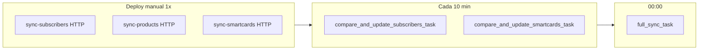

# Flujo de sincronización (deploy → periódico → correctivo)

Modelo operativo acordado para producción.

## Resumen en 3 fases

| Fase | Cuándo | Qué | Cómo |
|------|--------|-----|------|
| **1. Deploy** | Una vez, manual (staff/VPN) | Carga inicial de catálogos | HTTP `sync-subscribers`, `sync-products`, `sync-smartcards` |
| **2. Mantenimiento** | Cada `CELERY_SYNC_MINUTES` (10 min prod) | BD al día vs PanAccess | Celery Beat automático |
| **3. Correctivo** | 1× día (`CELERY_FULL_SYNC_HOUR`, default 00:00) | Auditoría global + login info | `full_sync_task` |

---

## Fase 1 — Deploy (manual, una vez)

Tras `migrate` y con **worker + beat** arrancados, ejecutar **en este orden** (JWT staff).

Con `SYNC_HTTP_ASYNC=true` (default) cada POST responde **202** y `task_id`; el worker ejecuta la tarea. Ver [SYNC_HTTP_ASYNC.md](./SYNC_HTTP_ASYNC.md).

```http
POST /wind/sync-subscribers/?limit=200
POST /wind/sync-products/?limit=200
POST /wind/sync-smartcards/?limit=200
Authorization: Bearer <token_staff>
```

Seguimiento: `GET /api/v1/tasks/<task_id>/`

| Endpoint | Función | Efecto |
|----------|---------|--------|
| `sync-subscribers` | `sync_subscribers()` | BD vacía → descarga completa; si ya hay datos → solo nuevos desde último `code` |
| `sync-products` | `sync_products()` | Igual lógica para productos |
| `sync-smartcards` | `sync_smartcards()` | BD vacía → descarga completa; si hay datos → reconciliación |

**No** hace falta llamar `compare-and-update-subscribers` aquí si la BD estaba vacía: el sync inicial ya pobló las tablas. El compare periódico (fase 2) y el full-sync (fase 3) cubren el resto.

Opcional: encolar sin bloquear Gunicorn (mismo resultado, worker Celery):

```python
from wind.tasks import sync_subscribers_task, sync_smartcards_task
# productos: solo HTTP o esperar al full-sync nocturno
sync_subscribers_task.delay()
sync_smartcards_task.delay()
```

---

## Fase 2 — Mantenimiento (Celery Beat)

Variables típicas en `.env` (producción):

```env
CELERY_SYNC_MINUTES=10
CELERY_SMARTCARD_SYNC_MINUTES=10
CELERY_SYNC_LIMIT=200
```

### Ajuste según volumen (tuning)
`CELERY_SYNC_LIMIT` define cuántos registros procesa **por ciclo** en compare. Si PanAccess tiene decenas de miles:

- **Síntoma**: la BD local queda atrasada (lag) aunque Beat corre sin errores.
- **Acciones típicas**:
  - Subir `CELERY_SYNC_LIMIT` (máximo efectivo vía HTTP: 1000).
  - Bajar `CELERY_SYNC_MINUTES` / `CELERY_SMARTCARD_SYNC_MINUTES` (más frecuencia).
  - Subir límites de tiempo si las tareas expiran:
    - `CELERY_TASK_SOFT_TIME_LIMIT` (default 540s)
    - `CELERY_TASK_TIME_LIMIT` (default 600s)
    - Para full-sync: `CELERY_FULL_SYNC_SOFT_TIME_LIMIT` / `CELERY_FULL_SYNC_TIME_LIMIT`

Regla práctica: subir el límite **de a poco** y monitorear `panaccess.log`, duración de tareas y tamaño de cola.

| Tarea Beat | Task Celery | Función |
|------------|-------------|---------|
| `compare-and-update-subscribers` | `compare_and_update_subscribers_task` | `compare_and_update_all_subscribers()` — crea, actualiza, **elimina** locales que ya no están en PanAccess |
| `compare-and-update-smartcards` | `compare_and_update_smartcards_task` | `compare_and_update_all_smartcards()` — crea, actualiza, **elimina** |

**No** está programado en Beat:

- `sync_subscribers_task` (solo manual / encolado explícito tras deploy).
- `sync-products` (solo deploy manual + full-sync nocturno).

Mientras corre el **full-sync** (fase 3), estas tareas devuelven `skipped: full_sync in progress`.

---

## Fase 3 — Correctivo nocturno

```env
CELERY_FULL_SYNC_ENABLED=true
CELERY_FULL_SYNC_HOUR=0
CELERY_FULL_SYNC_MINUTE=0
FULL_SYNC_HTTP_ENABLED=false
```

`full_sync_task` → `run_full_sync()`:

- Reconciliación completa suscriptores, productos, smartcards (con borrado de extras).
- Sync masivo de login info + limpieza de huérfanos.

Ver [FULL_SYNC_PRODUCCION.md](./FULL_SYNC_PRODUCCION.md).

---

## Diagrama



---

## Comprobar en el servidor

```bash
# Beat debe listar compare-and-update-subscribers, no sync-subscribers
python -m celery -A serverpanaccess inspect scheduled

python manage.py shell -c "
from wind.tasks import compare_and_update_subscribers_task
r = compare_and_update_subscribers_task.delay()
print('task_id', r.id)
"
```

Logs del worker: `compare_and_update_subscribers_task` / `compare_and_update_smartcards_task`.

---

## Referencias

- [DESPLIEGUE.md](./DESPLIEGUE.md) — worker, beat, cola `sync_subscribers`
- [REDIS_CELERY_UBUNTU.md](./REDIS_CELERY_UBUNTU.md)
- [FULL_SYNC_PRODUCCION.md](./FULL_SYNC_PRODUCCION.md)
